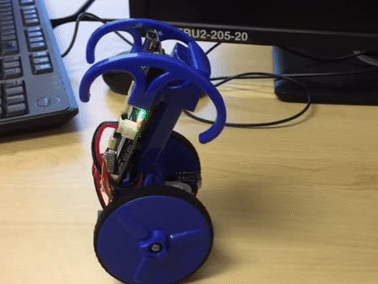
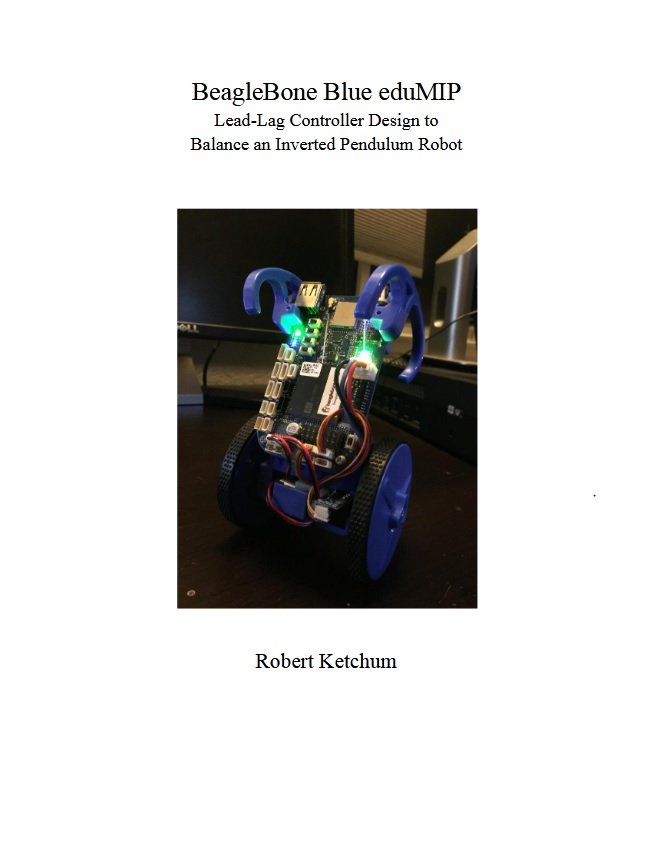

# BeagleBone Blue eduMIP Inverting Pendulum

MATLAB and C-code for creating and implementing a controller into a BeagleBoneBlue with eduMIP.

## Video of the Robot (click on gif)

## Report on the design process

