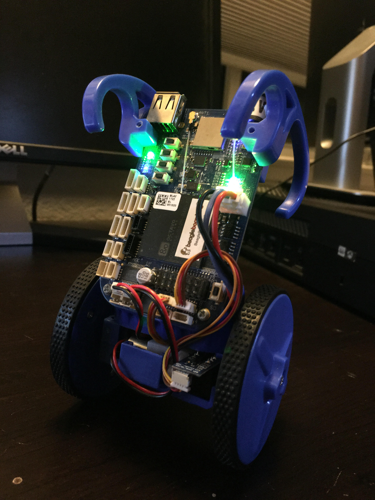

# BeagleBone Blue eduMIP Inverting Pendulum

MATLAB and C-code for creating and implementing a controller into a BeagleBoneBlue with eduMIP.

For more information, please see:

[-A video demonstrating the balancing robot](https://www.youtube.com/watch?v=53ShETFpYco)

[-A report detailing the derivation of the equations of motion of the eduMIP utilizing Lagrangian and Newtonian mechanics, the design of two Lead-Lag Compensators using MATLAB, and the implementation of the compensators in C-Programming Language.](./eduMIP.pdf)

